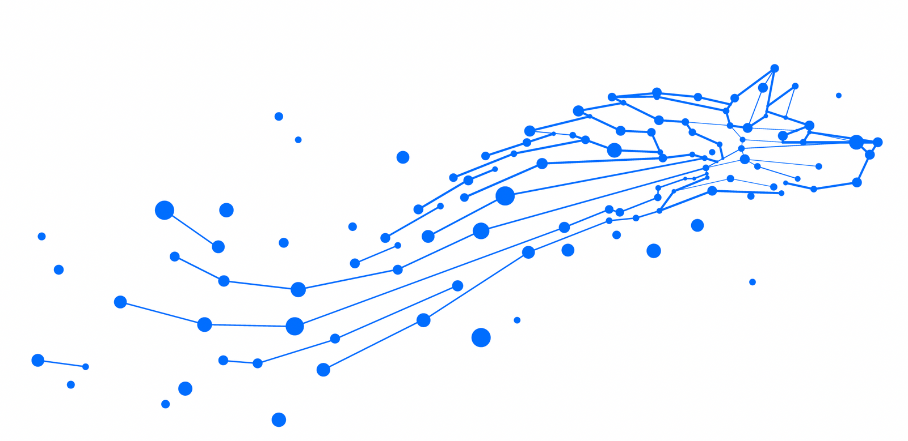

# Bitdefender AC Labs 2025

Reverse Engineering and Malware Analysis

## Description

We’ll uncover what makes certain programs vulnerable and how these weak points could be exploited.
We will understand how privacy could be violated by malicious agents (using mobile devices) as well as simulate how a nation-wide cyberattack would look like.

## Objectives

• Understanding the way software systems work and how they could be taken over by malicious actors

• Developing an analytic mindset

• Understanding concepts regarding Security, Personal data, Vulnerabilities and Cyberthreats

## Tasks

• Analysis of Windows programs

• Exploiting Windows programs

• Virus analysis (infectors of Windows executables)

• Analysis of Android applications

• Attacks against Android users

• Operating System architecture (Windows, Linux/Android)

• Capture the Flag, CrackMe

